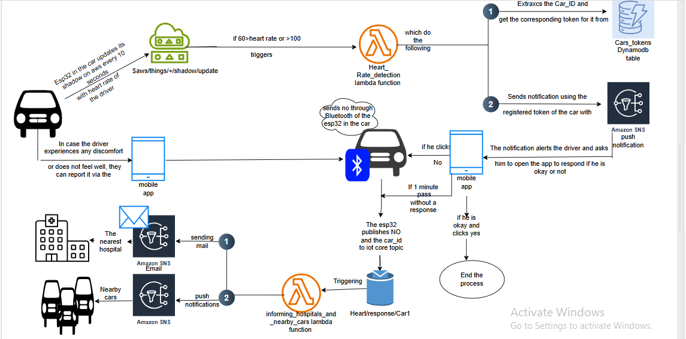
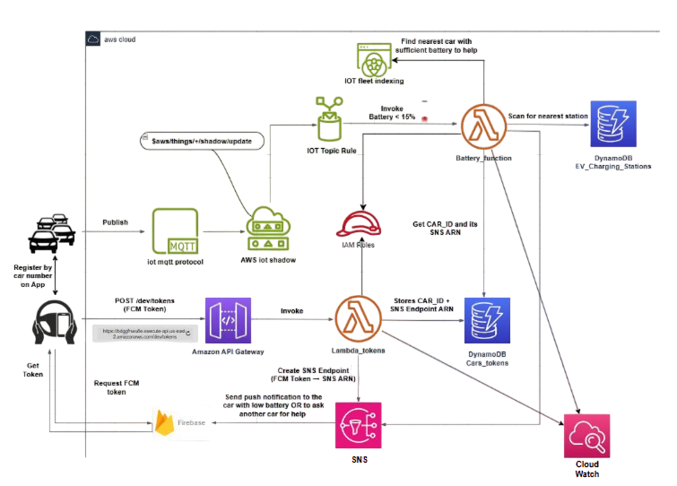

#  V2X Smart AWS Cloud System  

A graduation project that integrates **Advanced Driver Assistance Systems (ADAS)** with **Vehicle-to-Everything (V2X)** communication using **AWS Cloud Services**.  

The system connects vehicles, infrastructure, and cloud services to provide **real-time safety, health monitoring, garage reservation, and charging station assistance**.  
All AWS Lambda functions are written in **Python** to ensure scalability, reliability, and maintainability.  

---
### 🔐 Authentication & Notifications Setup  

Before any feature can work, the system must associate each car with a unique **Firebase token** for push notifications.  

- **Driver login (Kodular App):**  
  The driver enters their Car ID in the app.  

- **Token registration:**  
  The app requests a new token from Firebase and sends it (with Car ID) to **API Gateway** (POST request).  

- **AWS Lambda (Python):**  
  Stores the Car ID → Token mapping in the `Cars_tokens` DynamoDB table.  
  It also registers the token as an **SNS endpoint**, so alerts can be delivered directly to that driver.  

📂 [See Lambda Code](lambda_functions/token_registration_lambda.py)

---

##  Key Features  

###  Emergency Health Alert (V2V + V2I)  
- **Detection phase:** ESP32 reads driver’s heart rate and publishes it every 10 seconds (with GPS, geohash, battery, etc.).  
- **Driver alerting:** If abnormal heart rate detected, system pushes a notification asking the driver to confirm within **30 seconds**.  
- **Escalation:** If no response → Lambda escalates alert to:  
  - Nearest hospital (email via SES).  
  - Nearby cars in same **geohash** (push via SNS).  

- **Importance:** Enables early medical intervention and ensures surrounding drivers can assist.  

###  Smart Garage Reservation (V2I)  
- Driver books the **nearest available garage** via the app.  
- Reservation details are stored in DynamoDB; garage slot availability auto-updated.  
- Driver receives a **confirmation email** with a temporary **ticket link** (HTML in S3, expires after reservation period).  
- After expiry → scheduled Lambda deletes ticket and frees the slot automatically.  
.jpg)
- **Importance:** Saves time, avoids congestion, prevents forgotten reservations.  

###  Low-Battery Charging Assistance (V2I)  
- If battery level is low, system finds the **nearest charging station** from DynamoDB using geohash lookup.  
- Location returned instantly to driver through app.  

- **Importance:** Avoids vehicle breakdown in critical places (e.g., highways, tunnels).  

---

##  System Architecture  

  

- **ESP32** collects: car ID, GPS, geohash, heart rate, battery.  
- **AWS IoT Core** → sends data to cloud every 10s.  
- **AWS Lambda (Python)** → processes data for health alerts, garage booking, battery checks.  
- **DynamoDB** → stores tokens, stations, garages, reservations.  
- **SNS & SES** → push notifications & emails.  
- **S3** → reservation tickets.  
- **Kodular App** → driver’s interface for login, alerts, and reservations.  

---
 

##  Technologies Used  

- **AWS IoT Core** – real-time telemetry ingestion  
- **AWS Lambda (Python)** – serverless logic for all workflows  
- **Amazon DynamoDB** – car tokens, garage data, charging stations  
- **Amazon SNS** – push notifications to driver & nearby cars  
- **Amazon SES** – hospital & driver emails  
- **Amazon S3** – reservation tickets  
- **Kodular** – driver mobile app interface  
- **ESP32 + Sensors** – car hardware  

---

##  Why This Matters  

This project demonstrates how **cloud-native solutions** can extend traditional ADAS into **collaborative, connected systems**.  

---

##  Future Work  

- Integration with real hospital APIs for emergency dispatch  
- More advanced geospatial queries (beyond geohash prefix)  
- Adding real-time traffic data for smarter garage recommendations  
- Extending to full **DevOps CI/CD pipeline** with GitHub Actions + AWS SAM  

---

